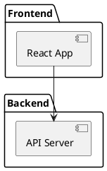
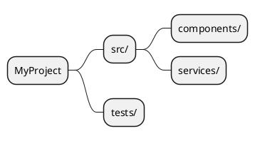

# create-readme — Claude Code Skill

A Claude Code slash-command skill that analyses any codebase and generates a professional `README.md` with **inline Mermaid diagrams** that render directly on GitHub — no copy-pasting required.

---

## What This Is

A single skill file (`skill.md`) you install once into Claude Code's skills directory. After that, typing `/create-readme` in any project triggers Claude to:

1. Read your actual source files, config files, and dependencies
2. Infer the problem + solution from the code
3. Write a complete `README.md` with:
   - Problem statement and solution summary
   - Architecture diagram (Mermaid flowchart — renders on GitHub)
   - Data flow / sequence diagram (Mermaid)
   - Module dependency graph (Mermaid)
   - Installation, usage, configuration, commands reference
   - Troubleshooting section (derived from error handling in the code)
   - Security section (if credentials/secrets are present)

All diagram content is generated **from actual code analysis** — not generic templates.

---

## What This Is Not

- **Not a documentation site generator** — it produces a single `README.md`, not HTML/wiki pages. Use [RepoWiki](../README.md) for that.
- **Not a docstring extractor** — it writes human-oriented narrative, not auto-generated API reference docs.
- **Not language-specific** — it works on any language Claude can read (Python, JS/TS, Java, Go, etc.) but depth of analysis depends on how readable the code is.
- **Not a replacement for writing docs yourself** — the output is a strong first draft. Review and edit before publishing.
- **Not guaranteed to be accurate** — Claude infers intent from code structure. Always verify technical details.

---

## Installation

Copy `skill.md` to your Claude Code skills directory:

```bash
# Windows
copy skill.md "%USERPROFILE%\.claude\skills\create-readme.md"

# macOS / Linux
cp skill.md ~/.claude/skills/create-readme.md
```

Or use the provided scripts:

```bash
# Windows
install.bat

# macOS / Linux
chmod +x install.sh && ./install.sh
```

Restart Claude Code after installing.

---

## Usage

Navigate to any project folder and run:

```
/create-readme
```

**If a `README.md` already exists**, Claude will ask before overwriting — you can choose to overwrite or generate `README-new.md` instead.

### Options you can specify in the prompt

```
/create-readme --no-diagrams        # Skip Mermaid diagrams
/create-readme --overwrite          # Overwrite existing README without asking
/create-readme focus on the API     # Add context to guide what Claude emphasises
```

---

## Why Mermaid, Not PlantUML

| | Mermaid | PlantUML |
|---|---|---|
| Renders on GitHub | ✅ Native support | ❌ Shows as raw text |
| Renders on GitLab | ✅ Native support | ❌ Requires plugin |
| Renders in VS Code | ✅ With Markdown Preview | ⚠️ Requires extension |
| Zero-install for readers | ✅ Yes | ❌ Need Java or online tool |

PlantUML diagrams require readers to copy-paste source into plantuml.com. Mermaid diagrams just render. This skill generates **Mermaid only**.

---

## Files in This Folder

```
create-readme-skill/
├── skill.md       ← The skill definition (this is what gets installed)
├── README.md      ← This file
├── install.bat    ← Windows install helper
└── install.sh     ← macOS/Linux install helper
```

---

## Updating the Skill

After editing `skill.md`, re-run the install script to push the update to Claude Code:

```bash
# Windows
install.bat

# macOS / Linux
./install.sh
```
4. Dependency visualization
5. Installation instructions
6. Usage examples
7. Tech stack details
8. Configuration guide

## Example Output

The skill generates READMEs with embedded PlantUML diagrams like this:

### Architecture Diagram


### Project Mindmap


See `examples/full-example-with-diagrams.md` for a complete example.

## How Diagrams Work

The generated README includes PlantUML code blocks that can be:
- Rendered at [plantuml.com](https://www.plantuml.com/plantuml/uml/)
- Viewed with VS Code PlantUML extension
- Embedded in GitHub (with PlantUML proxy)
- Copied to Confluence, Notion, or other tools

## Features

- **Automatic language detection** - Python, JavaScript, TypeScript, Go, Rust, Java, and more
- **Smart structure analysis** - Identifies entry points, dependencies, and architecture
- **Visual diagrams** - Component diagrams, mindmaps, and dependency graphs
- **Safety first** - Asks before overwriting existing README files
- **Context-aware** - Generates content from actual code, not templates

## What Makes This Different

Unlike generic README templates, this skill:
- Reads your actual codebase structure
- Generates diagrams based on real dependencies
- Extracts tech stack from package manifests
- Creates realistic usage examples from entry points
- Builds a mindmap of your actual folder structure

## Requirements

- Claude Code CLI or Desktop App
- Access to project source code
- (Optional) PlantUML renderer for viewing diagrams

## Testing the Skill

After installation, test it on your current projwiki project:

```bash
cd /path/to/any/project
/create-readme
```

The skill will analyze the project and create a README.md with all diagrams included.

## Troubleshooting

**Skill not found after installation:**
- Restart Claude Code
- Verify file location: `~/.claude/skills/create-readme.md`
- Check the filename ends with `.md`

**Diagrams not rendering:**
- Diagrams are in PlantUML text format
- Copy the code block to [plantuml.com](https://www.plantuml.com/plantuml/uml/) to render
- Or install a PlantUML extension in VS Code

## License

MIT
