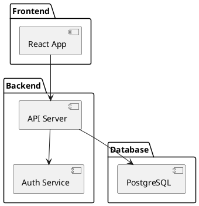

Great choice — this one has *real developer pain + strong demo value*. Let’s shape it into something you can actually build and show off.

---

# 🧩 Problem Statement

### 🧠 Core Problem

Developers struggle to **understand unfamiliar codebases quickly**.

When joining a new project, you often face:

* Scattered or outdated documentation
* No clear architecture overview
* Hard-to-trace dependencies between files/modules
* No glossary of domain-specific terms
* Tribal knowledge locked in teammates’ heads

---

### 🎯 Your Solution

> Build a tool that converts any codebase into a **self-contained, interactive “offline Wikipedia”**.

### 💡 One-liner

👉 *“Drop a repo → get a browsable, explorable knowledge hub (no internet required)”*

---

# 🏗️ Key Features (MVP → V1)

### 📁 1. Project Overview Page

* What the project does (AI-generated summary)
* Tech stack detection
* Folder structure visualization

---

### 🔗 2. Architecture Diagram (auto-generated)

Use **PlantUML** to create diagrams.

#### Example (Component Diagram)



👉 Your tool should:

* Parse imports / dependencies
* Generate this automatically
* Export as PNG/SVG embedded in HTML

---

### 🧠 3. File-Level Explanation

Click any file → see:

* Summary of what it does
* Key functions/classes
* Important logic explained
* “Why this file exists”

---

### 📚 4. Glossary (Super Important 🔥)

Auto-generate terms like:

* “JWT”
* “Middleware”
* “Rate Limiting”
* Project-specific terms

#### Example Output

```
AuthService:
Handles user authentication, token validation, and session management.

Middleware:
Functions that run before request handlers to modify or validate requests.
```

👉 Extract from:

* Variable names
* Comments
* Repeated patterns

---

### 🔍 5. Relationship Explorer

* “Where is this function used?”
* “Which files depend on this module?”

Think:

* mini static analysis graph

---

### ⚡ 6. CLI Interface

Simple and clean (this is important for adoption):

```bash
projwiki ./my-project
```

Optional flags:

```bash
projwiki ./my-project --depth 3
projwiki ./my-project --diagram-only
projwiki ./my-project --offline
```

---

### 📦 Output

A single folder (or HTML bundle):

```
/output
  index.html
  /assets
  architecture.png
  data.json
```

👉 Open `index.html` → full experience

---

# 🧠 System Design (Simple Version)

### Flow

```
Codebase → Parser → AI Summarizer → Diagram Generator → Static Site Builder
```

---

### Components

#### 1. Parser

* Reads files
* Extracts:

  * imports
  * classes/functions
  * comments

#### 2. AI Layer

* Summarizes files
* Generates glossary
* Explains architecture

#### 3. Diagram Engine

* Converts dependency graph → PlantUML

#### 4. Frontend Generator

* Static HTML + JS
* Search + navigation

---

# 🧪 Example User Flow

1. User runs:

```bash
projwiki ./my-startup-backend
```

2. Tool outputs:

* Summary
* Diagrams

* Glossary
* Searchable UI

3. User opens:

```bash
open index.html
```

4. They can:

* Explore architecture
* Click files
* Search terms
* Understand system in minutes

---

# 🔥 What Makes This Special

* Works **offline**
* Zero setup after generation
* Shareable (like your Idea1)
* Helps onboarding massively

---

# ⚙️ Suggested Tech Stack

### Backend

* Python (fast to build)

  * `ast` module for parsing
  * `networkx` for graphs

### AI

* Local model or API

### Diagrams

* PlantUML

### Frontend

* Static HTML + JS (no framework needed)
* Optional: lightweight React

---

Start with just:

1. Parse files
2. Generate summaries
3. Build one page with:

   * file list
   * click → explanation

Then add:

* diagrams
* glossary
* search

---

If you want next step, I can:
👉 design the **exact folder structure + starter code**
👉 or give you a **prompt template to generate summaries cleanly**
